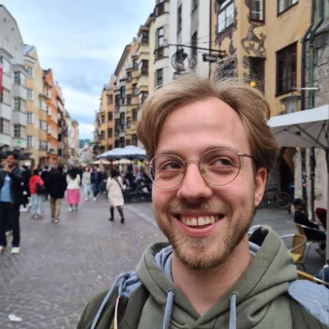
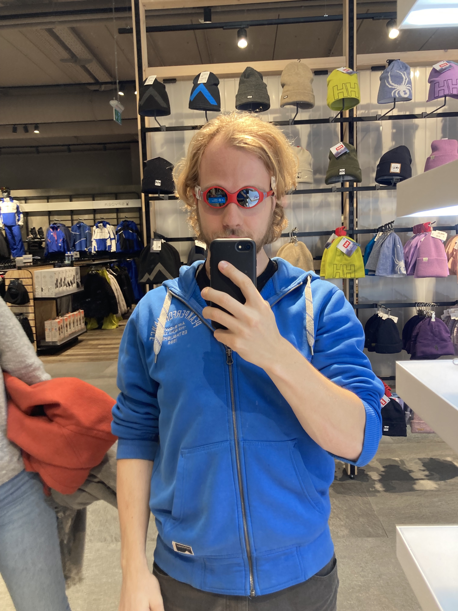
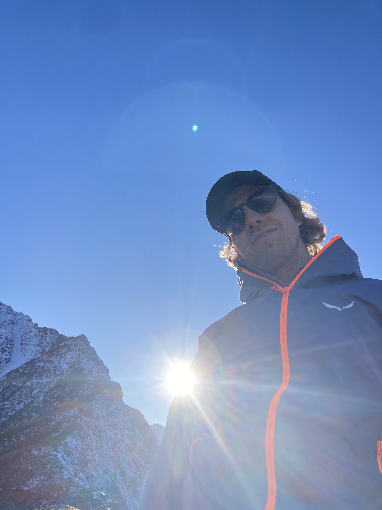

I am a PhD student in the labs of Janosch Hennig and Olivier Duss at EMBL Heidelberg. Using TIRF microscopy we are investigating how RNA-binding proteins assemble onto an mRNA to repress its translation looking at mRNP stability, cooperativity of RBPs, how RNA structure mediates the kinetics of assembly and lastly target motif recognition. If I'm not in the lab, you can find me bouldering, skiing, rock climbing or coding.

<a href="https://www.linkedin.com/in/marco-payr-631854b7/" target="_blank">LinkedIn</a>

<a href="https://github.com/marcopollino" target="_blank">GitHub</a>

<a href="https://twitter.com/MarcoPayr" target="_blank">Twitter</a>

<a href="https://www.embl.org/groups/duss/" target="_blank">Duss Lab</a>

<a href="https://www.embl.org/groups/hennig/" target="_blank">Hennig Lab</a>


  
  
  
  
  
  


